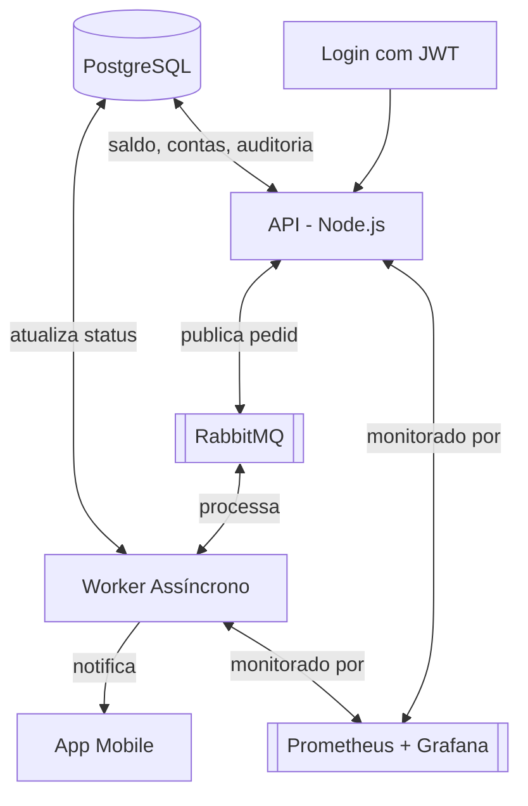
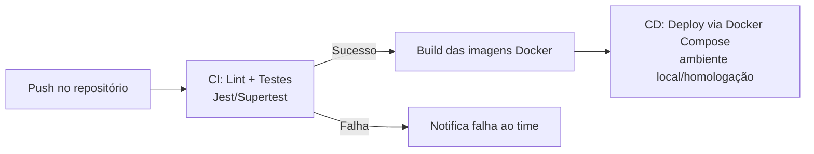

# PulsePay — Pagamentos Instantâneos (Projeto Acadêmico)

> Projeto desenvolvido para a disciplina de Projeto de Software com DevOps (Pós-graduação).
> **Aviso:** este é um projeto fictício/didático, sem finalidade comercial e sem processamento de transações financeiras reais.

---

## 1. Visão Geral

O PulsePay é uma aplicação que simula uma fintech de pagamentos instantâneos, inspirada em sistemas como PIX/carteiras digitais. O objetivo do projeto é aplicar, em escala acadêmica, conceitos de **arquitetura de software distribuída**, **processamento assíncrono** e **práticas de DevOps** (containerização, CI/CD, observabilidade básica).

O sistema permite que usuários se cadastrem, consultem saldo/extrato e realizem transferências entre contas, com efetivação processada de forma assíncrona via fila de mensagens, garantindo consistência e simulando uma trilha de auditoria imutável. O projeto mantém como meta de referência o SLA original do cenário proposto — **99,95% de disponibilidade** e **confirmação da transação em até 2 segundos** — validado via testes de carga e dashboards de observabilidade (Grafana), conforme detalhado na seção 6.

**Arquitetura escolhida:** Monolito modular + fila de mensagens, com backend em Node.js, banco relacional PostgreSQL, fila RabbitMQ e worker assíncrono dedicado — tudo orquestrado via Docker Compose.

### Diagrama de Arquitetura

### Componentes

| Componente | Responsabilidade |
|---|---|
| **Frontend Web** | Login/cadastro, consulta de saldo/extrato, solicitação de transferências |
| **Middleware de Autenticação (JWT)** | Valida o token em cada requisição protegida, garantindo que apenas usuários autenticados movimentem contas — ponto central da estratégia de segurança do projeto |
| **Módulo Contas** | Consulta de saldo, extrato, validação de existência/status da conta |
| **Módulo Transferência** | Valida regras de negócio, grava transação como `PENDENTE`, publica na fila |
| **PostgreSQL** | Fonte única da verdade: contas, transações e auditoria |
| **RabbitMQ** | Desacopla solicitação da efetivação da transferência, absorve picos |
| **Worker Assíncrono** | Efetiva débito/crédito, atualiza status para `CONCLUÍDO`, dispara notificação e auditoria |
| **Notificação (WebSocket)** | Avisa o usuário em tempo real quando a transferência é concluída |
| **Tabela de Auditoria** | Log append-only (sem UPDATE/DELETE) de todos os eventos relevantes |
| **Prometheus** | Coleta métricas de API, Worker e fila (latência, throughput, taxa de erro, tamanho da fila) |
| **Grafana** | Dashboards visuais para acompanhar SLA de disponibilidade e tempo de confirmação em tempo real |

> **Nota sobre o SLA original (99,95% de disponibilidade / confirmação em até 2s):** como o projeto roda em ambiente local/acadêmico (Docker Compose, sem infraestrutura redundante real), esse SLA é tratado como **meta de referência a ser demonstrada via simulação e dashboards do Grafana**, e não como uma garantia contratual de produção. A seção 6 (Plano de Operação) detalha como isso é simulado.

---

## 2. Escopo (Principais Funcionalidades)

### Incluído no escopo
- [ ] Cadastro de usuário com KYC básico (nome, CPF fictício, e-mail)
- [ ] Autenticação via **JWT** (login gera token, rotas de conta/transferência exigem token válido) — escolhido deliberadamente por ser um projeto sobre transação financeira, servindo como demonstração prática de um mecanismo de segurança real de mercado
- [ ] Consulta de saldo da conta
- [ ] Extrato de transações (recebidas e enviadas)
- [ ] Solicitação de transferência entre duas contas
- [ ] Processamento assíncrono da transferência via fila
- [ ] Notificação em tempo real ao usuário destinatário
- [ ] Trilha de auditoria imutável (somente inserção)
- [ ] Painel de monitoramento básico da fila (RabbitMQ Management)
- [ ] Pipeline de CI/CD (build, testes e deploy automatizado dos containers)
- [ ] Observabilidade com Prometheus + Grafana (métricas de latência, throughput e disponibilidade)

### Fora do escopo
- Integração com sistemas bancários reais ou gateways de pagamento
- Processamento de dados financeiros/pessoais reais
- Autenticação multifator, criptografia de nível bancário
- Alta disponibilidade multi-região, disaster recovery
- Testes de carga em escala de produção

---

## 3. Cronograma (4 Entregas)

| Entrega | Etapa | Atividades |
|---|---|---|
| **Entrega 1** | Planejamento do Projeto *(hoje)* | Definição da arquitetura, escopo, stack tecnológica, estratégia de segurança (JWT) e plano de desenvolvimento (este documento) |
| **Entrega 2** | CI/MVP (Front e Back) | Modelagem do banco (schema Prisma), setup do Docker Compose, implementação do MVP: autenticação JWT, Módulo Contas e Transferência, frontend básico integrado; configuração do pipeline de **CI/CD** (build + testes automatizados a cada push, deploy dos containers) |
| **Entrega 3** | Observabilidade (Grafana) | Integração com RabbitMQ e Worker assíncrono completo, instrumentação da API/Worker com métricas (Prometheus), montagem dos dashboards no **Grafana** (latência, throughput, tamanho da fila, taxa de erro), notificações via WebSocket |
| **Entrega 4** | Plano de Teste e de Escala | Testes de concorrência/race condition, teste de carga simulando o SLA (99,95% de disponibilidade / confirmação em até 2s), ajustes finais de performance, documentação de resultados e apresentação do projeto |

### Pipeline de CI/CD (visão geral — Entrega 2 em diante)

> Ferramenta sugerida: **GitHub Actions**, por ser gratuita para repositórios acadêmicos e simples de integrar com Docker Compose.

---

## 4. Estratégia de Testes

| Tipo de teste | Ferramenta sugerida | O que valida |
|---|---|---|
| **Testes unitários** | Jest | Regras de negócio isoladas (ex: cálculo de saldo, validação de dados) |
| **Testes de integração** | Jest + Supertest | Endpoints da API (ex: `POST /transferencias` retorna status `PENDENTE`) |
| **Teste do fluxo assíncrono** | Script manual + logs do Worker | Verificar se a mensagem publicada no RabbitMQ é consumida e o status muda para `CONCLUÍDO` |
| **Teste de concorrência** | Script simulando 2 transferências simultâneas na mesma conta | Validar que não ocorre saldo negativo (race condition) |
| **Teste de imutabilidade** | Query manual/script tentando `UPDATE`/`DELETE` na tabela de auditoria | Confirmar que a trigger de bloqueio funciona |

> Observação: dado o tempo curto do projeto (4 entregas), a cobertura de testes será focada nos módulos críticos (Transferência e Worker), não sendo exigida cobertura total do código. O teste de carga com `k6` (Entrega 4) é o que efetivamente valida o SLA de disponibilidade e tempo de confirmação descrito na seção 6.

---

## 5. Estratégia de Segurança

Ainda que o projeto seja acadêmico e não movimente dados reais, algumas práticas básicas de segurança serão aplicadas para fins didáticos:

- **Autenticação:** uso de **JWT** para proteger rotas da API — escolha deliberada do grupo, dado que o projeto simula transações financeiras: o JWT demonstra na prática um mecanismo de segurança real de mercado (emissão de token no login, validação em middleware, expiração de token) sem exigir infraestrutura complexa de identidade.
- **Hash de senhas:** bcrypt para armazenamento de senha dos usuários (nunca em texto puro).
- **Validação de entrada:** validação de payloads (ex: com `zod` ou `joi`) para evitar dados malformados chegando ao banco.
- **Variáveis sensíveis:** uso de arquivo `.env` (não versionado) para credenciais do banco e RabbitMQ.
- **Imutabilidade da auditoria:** trigger no PostgreSQL bloqueando `UPDATE`/`DELETE` na tabela `auditoria`, simulando trilha auditável.
- **Isolamento de rede:** containers do Docker Compose se comunicam em rede interna, apenas as portas necessárias (frontend, API, painel do RabbitMQ) expostas ao host.

> Não fazem parte do escopo: criptografia de dados em repouso, WAF, testes de penetração, compliance regulatório (LGPD/PCI-DSS) — mencionados apenas como pontos de evolução futura no relatório.

---

## 6. Plano de Operação

O SLA original do projeto (**99,95% de disponibilidade** e **confirmação de transação em até 2 segundos**) é adotado como meta a ser **simulada e demonstrada** via testes de carga e dashboards do Grafana, já que o ambiente é local (Docker Compose) e não uma infraestrutura de produção redundante. Os números abaixo definem o cenário de simulação usado para validar essa meta.

| Métrica | Meta simulada para o projeto |
|---|---|
| Usuários simultâneos (simulados) | 100–150 usuários fictícios |
| Requisições por segundo (RPS) | ~30–50 req/s em teste de carga local |
| Tempo de resposta da API (resposta "recebido") | < 500ms (parte síncrona, antes da fila) |
| Tempo de confirmação da transação (ponta a ponta, conforme SLA) | ≤ 2 segundos (solicitação → status `CONCLUÍDO` pelo Worker) |
| Disponibilidade alvo (simulada) | 99,95% durante a janela de teste de carga (medida via uptime dos containers no Grafana) |
| Pico simulado | Rajada de ~150 req/s por 1 minuto, simulando dia de pagamento de salário/data comercial (conforme cenário do projeto original) |
| Ferramenta de teste de carga | `k6`, com cenário de carga constante + pico, exportando métricas para o Prometheus/Grafana |

> **Como o SLA é validado na prática:** o Grafana exibirá um painel dedicado com (1) percentual de requisições que confirmaram em até 2s, (2) uptime dos containers durante a janela de teste, e (3) tamanho da fila do RabbitMQ ao longo do pico — permitindo visualizar se o sistema absorve o pico sem estourar o tempo de confirmação.

---

## 7. Riscos Conhecidos

| Risco | Descrição | Mitigação |
|---|---|---|
| **Atomicidade** | Debitar de uma conta e creditar em outra precisa ser tudo ou nada; falha no meio do processo pode gerar dinheiro "perdido" ou duplicado | Uso de transações ACID do PostgreSQL dentro do Worker ao efetivar débito/crédito |
| **Race condition** | Duas transferências simultâneas na mesma conta podem ler o mesmo saldo antes de qualquer uma escrever, causando saldo incorreto | Uso de locks otimistas/pessimistas no banco (`SELECT FOR UPDATE`) durante a efetivação |
| **Pouco tempo (4 entregas)** | Escopo pode não ser totalmente implementado dentro do prazo | Priorização das funcionalidades core (transferência + fila + auditoria + JWT) sobre funcionalidades secundárias (ex: notificação pode ficar simplificada) |
| **Escopo grande para o prazo** | Tentar implementar todos os componentes com qualidade de produção (incluindo CI/CD e observabilidade) é ambicioso para 4 entregas | Uso da arquitetura "Nível Mediano", priorizando MVP funcional na Entrega 2 antes de investir em observabilidade (Entrega 3) e testes de escala (Entrega 4) |
| **Falha na fila (mensagem perdida)** | RabbitMQ não garante entrega exatamente uma vez por padrão | Implementar idempotência no Worker (verificar se transação já foi processada antes de aplicar novamente) |
| **Ambiente de desenvolvimento único** | Sem ambiente de homologação separado, bugs podem ser detectados tarde | Pipeline de CI rodando testes automatizados a cada push, reduzindo a chance de bugs chegarem à demo final |
| **SLA simulado não bater com o real** | Ambiente local (Docker Compose) pode não sustentar 99,95% de disponibilidade / 2s de confirmação sob carga, já que não há redundância real de infraestrutura | Documentar claramente que o SLA é validado em ambiente simulado (Entrega 4), com dashboards do Grafana como evidência, e não como garantia de produção |

---

## 8. Stack Tecnológica

| Camada | Tecnologia |
|---|---|
| Frontend | React (Vite) |
| Backend | Node.js + Express |
| Autenticação | JWT (`jsonwebtoken`) + bcrypt |
| ORM | Prisma |
| Banco de Dados | PostgreSQL |
| Fila de Mensagens | RabbitMQ (`amqplib`) |
| Notificação em tempo real | Socket.io (WebSocket) |
| Observabilidade | Prometheus + Grafana |
| CI/CD | GitHub Actions |
| Containerização | Docker + Docker Compose |
| Testes de unidade/integração | Jest + Supertest |
| Teste de carga | k6 |

### Containers (Docker Compose)

| Serviço | Imagem/Base | Porta local |
|---|---|---|
| frontend | node (build React) | 3000 |
| api | node (Express) | 4000 |
| worker | node (mesmo código, processo diferente) | — |
| postgres | postgres:16 | 5432 |
| rabbitmq | rabbitmq:3-management | 5672 / 15672 |
| prometheus | prom/prometheus | 9090 |
| grafana | grafana/grafana | 3001 |

---

### 9. Disciplinas Críticas

Integração e Entrega Contínua
Desenvolvimento de Software Seguro – DevSecOps
Testes Automatizados e Contínuos
Monitoramento e Análise de Logs
Direito Digital e LGPD
Orquestração de Contêineres e Gerenciamento de Cluster

## 10. Autores

- Kayan Kayser
- Mário Gonçalves
- Victor Sabino

## 11. Disciplina

Projeto de Software com DevOps — Pós-graduação
