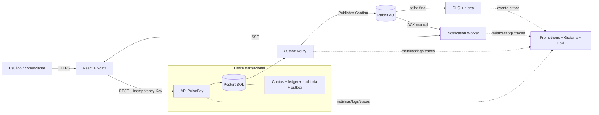

# Entrega 1 — Plano de Desenvolvimento e Arquitetura

| Campo | Valor |
|---|---|
| Projeto | PulsePay — Pagamentos Instantâneos |
| Disciplina | Pós-graduação em Engenharia de Software com foco em DevOps — UNIFOR |
| Equipe | Equipe 01 |
| Autor | Mário_DEV (`mario_gmm@hotmail.com`) |
| Data | 29/08/2026 — Aula 1 |
| Estado | Proposta para aprovação |

## 1. Resumo executivo

O PulsePay é uma fintech de carteira digital para cadastro/KYC básico, transferências instantâneas entre contas, consulta de extrato e notificação em tempo real de valores recebidos. O núcleo financeiro exige consistência forte, rastreabilidade integral e resposta previsível; notificações e demais efeitos colaterais podem ser assíncronos, mas nunca podem ser silenciosamente descartados.

A arquitetura recomendada para o período de quatro aulas é um **monólito modular orientado a eventos**, implantável como uma unidade, com limites de domínio explícitos. Essa escolha reduz o risco de prazo e elimina transações distribuídas no fluxo financeiro sem fechar a porta para extração futura de serviços.

As decisões fundamentais são:

1. PostgreSQL como fonte de verdade para contas, saldos, transferências, razão contábil, idempotência, auditoria e Outbox.
2. Transferência, partidas dobradas, atualização da projeção de saldo, evento de auditoria e registro de Outbox confirmados em **uma única transação ACID**.
3. RabbitMQ somente depois do commit, com mensagens persistentes, Publisher Confirms, filas duráveis/quorum, ACK manual, retentativas limitadas e DLQ.
4. Processamento pelo menos uma vez (*at-least-once*), com idempotência ponta a ponta. Não se promete “exactly once” distribuído.
5. Livro-razão *append-only* em valores inteiros na menor unidade monetária; saldo mutável é uma projeção reconciliável, não a única evidência financeira.
6. Auditoria resistente a adulteração por controles de banco, encadeamento criptográfico segmentado e selos periódicos em armazenamento WORM dentro do Brasil.
7. Meta de disponibilidade de 99,95% e confirmação no limite de 2 s tratadas como SLOs mensuráveis, com metas internas mais estritas e orçamento de erro.

## 2. Escopo

### 2.1 Incluído no MVP

- Cadastro de usuário com nome, e-mail, telefone, CPF, endereço mínimo e aceite de termos.
- Autenticação por e-mail/senha, senha com hash forte e emissão de token de acesso de curta duração.
- KYC básico com estados `PENDING`, `APPROVED` e `REJECTED`; nesta etapa, a validação pode ser simulada/manual e deve ficar atrás de uma interface substituível.
- Criação de uma conta em BRL por usuário aprovado.
- Consulta de saldo disponível.
- Transferência interna entre duas contas PulsePay com:
  - valor positivo em centavos, sem ponto flutuante;
  - chave de idempotência obrigatória;
  - validação de conta, saldo e limite;
  - débito e crédito atômicos;
  - recibo com identificador e estado definitivo.
- Extrato paginado, ordenado e filtrável por período.
- Notificação em tempo real de transferência recebida por Server-Sent Events (SSE); WebSocket é alternativa se houver requisito bidirecional posterior.
- Trilha de auditoria para autenticação, KYC, transferência e ações administrativas.
- Health checks, métricas, logs JSON correlacionados e rastreamento distribuído básico.

### 2.2 Fora do MVP

- Integração real com PIX/SPI, bancos, cartões, boletos ou adquirentes.
- Saque, depósito externo, estorno, chargeback, agendamento e recorrência.
- Múltiplas moedas, câmbio, crédito, parcelamento e rendimento.
- Antifraude/AML avançado, biometria e validação documental por fornecedor externo.
- Aplicativos móveis nativos; o front será web responsivo.
- Marketplace, checkout completo para lojista e conciliação fiscal.
- Arquitetura de microserviços, service mesh, multi-região ou *active-active* no MVP.
- Backoffice completo; somente o mínimo necessário para alterar o estado do KYC em ambiente de demonstração.

Qualquer item fora desta lista entra no backlog e não pode bloquear a fatia vertical “cadastro → transferência → extrato → notificação”.

## 3. Visão geral da arquitetura

### 3.1 Componentes

| Componente | Responsabilidade | Tecnologia proposta |
|---|---|---|
| Front web | Cadastro, login, saldo, transferência, extrato e canal SSE | React, TypeScript, Vite, Nginx |
| API / monólito modular | Regras de identidade, KYC, contas, transferências, ledger, extrato, auditoria e idempotência | Java 21, Spring Boot 3.x, Spring Security, Spring JDBC, Flyway |
| PostgreSQL | Fonte de verdade transacional | PostgreSQL 17+, pool HikariCP |
| Outbox Relay | Publica eventos já confirmados no banco | Worker do mesmo artefato, com eleição/concorrência por `SKIP LOCKED` |
| Broker | Desacoplamento e retenção dos eventos | RabbitMQ 4.x, filas quorum em produção |
| Notification Worker | Consome evento, registra Inbox e entrega a notificação | Módulo/worker Java; ACK somente depois do efeito persistente |
| Canal em tempo real | Entrega da notificação ao navegador | SSE autenticado, com reconexão e `Last-Event-ID` |
| Observabilidade | Métricas, painéis, alertas e logs pesquisáveis | OpenTelemetry/Micrometer, Prometheus, Grafana, Loki, Alertmanager |
| CI/CD | Build reprodutível, testes e segurança da cadeia | GitHub Actions, Docker/BuildKit, CodeQL/Semgrep, Trivy, SBOM e OIDC |
| Nuvem futura | Execução multi-AZ e dados residentes no Brasil | Kubernetes gerenciado, PostgreSQL gerenciado, object storage WORM, IaC |

Spring JDBC é preferido no fluxo monetário para tornar SQL, ordem de locks e limites transacionais explícitos. ORM pode ser usado fora do *hot path*, desde que não esconda consultas ou locks.

### 3.2 Contexto e fluxo

### 3.3 Fluxo de uma transferência

1. O cliente envia `POST /transfers` com token, valor, conta de destino e `Idempotency-Key` única por intenção.
2. A API valida autenticação, formato, KYC, limites e associação da chave ao corpo da requisição. A combinação usuário/chave possui restrição `UNIQUE`.
3. Dentro de uma única transação de banco, a aplicação:
   1. recupera e bloqueia as duas contas com `SELECT ... FOR UPDATE`, sempre na ordem crescente de ID;
   2. valida estados e saldo disponível já sob lock;
   3. cria a transferência;
   4. insere duas partidas imutáveis no ledger: débito da origem e crédito do destino, cuja soma algébrica é zero;
   5. atualiza a projeção de saldo das duas contas;
   6. acrescenta o evento de auditoria;
   7. acrescenta `transfer.completed` à tabela Outbox;
   8. confirma tudo em um único commit.
4. A API retorna o recibo confirmado sem aguardar RabbitMQ ou notificação. Isso mantém o caminho crítico curto e evita que indisponibilidade do broker reverta uma movimentação válida.
5. O Outbox Relay lê lotes com concorrência controlada, publica mensagem persistente e só marca o registro como publicado após `Publisher Confirm`.
6. Se o processo cair depois de publicar e antes de marcar a Outbox, a mensagem será repetida. Cada consumidor registra o `event_id` em uma tabela Inbox com `UNIQUE`, tornando o efeito idempotente.
7. O Notification Worker persiste a notificação, entrega via SSE e emite ACK manual. Falhas transitórias usam retentativa exponencial com *jitter*; após o limite, a mensagem vai para DLQ e gera alerta imediato.
8. Em caso de timeout do cliente, a mesma chave de idempotência recupera o resultado original. O sistema nunca responde sucesso antes do commit e nunca cria uma segunda transferência para a mesma intenção.

Esse desenho resolve o intervalo clássico “banco confirmou, fila falhou” sem usar *dual write* nem transação distribuída.

### 3.4 Modelo financeiro mínimo e invariantes

Entidades principais: `users`, `kyc_profiles`, `accounts`, `transfers`, `ledger_entries`, `idempotency_keys`, `audit_events`, `outbox_events`, `inbox_events` e `notifications`.

Invariantes obrigatórios:

- Dinheiro é armazenado como `BIGINT` em centavos de BRL; ponto flutuante é proibido.
- Para cada transferência concluída, `SUM(ledger_entries.amount) = 0`.
- Uma partida de ledger jamais sofre `UPDATE` ou `DELETE` pela aplicação.
- A projeção `accounts.balance` deve ser igual à soma das partidas efetivas da conta.
- Saldo não pode ficar negativo no MVP.
- A chave de idempotência não pode ser reutilizada com payload diferente.
- Uma transferência só fica visível como `COMPLETED` após o commit de todas as suas partidas.
- Toda transição de estado relevante gera `audit_event` com ator, origem, correlação, instante e hash do conteúdo.

Uma rotina automática de reconciliação compara saldo projetado e ledger. Qualquer divergência é incidente crítico, não correção automática silenciosa.

### 3.5 Limites dos módulos

- **Identity/KYC:** identidade, autenticação, autorização e estado do KYC.
- **Accounts:** ciclo de vida da conta e leitura de saldo.
- **Payments/Ledger:** transferência, locks, limites, partidas dobradas e idempotência.
- **Statements:** consultas paginadas sobre ledger/transferências.
- **Notifications:** Inbox, preferências e SSE.
- **Audit:** eventos, integridade criptográfica e exportação WORM.
- **Platform:** Outbox, mensageria, telemetria e health checks.

Dependências entre módulos passam por interfaces internas e eventos. Tabelas de outro módulo não são alteradas fora do serviço de aplicação que as controla. Essa disciplina torna possível extrair um módulo no futuro com evidência de necessidade, sem pagar esse custo agora.

## 4. Objetivos de qualidade e SLOs

| Indicador | Objetivo externo | Meta interna / alerta |
|---|---|---|
| Disponibilidade da criação/consulta de transferência | ≥ 99,95% por mês | objetivo interno 99,97%; alerta por consumo rápido/lento do orçamento |
| Confirmação da transferência | p99 ≤ 2 s | p95 ≤ 1 s e p99 ≤ 1,5 s; timeout do servidor em 1,8 s |
| Correção financeira | zero débito/crédito parcial; zero saldo negativo | reconciliação divergente = incidente SEV-1 |
| Durabilidade de transferência confirmada | nenhuma perda lógica aceita | RPO 0 para commits replicados; PITR para desastre operacional |
| Publicação da Outbox | p99 ≤ 5 s após commit | alerta se evento mais antigo > 15 s |
| Notificação recebida | p95 ≤ 3 s após commit | alerta se backlog/idade exceder limites |

Em uma janela de 30 dias, 99,95% permite aproximadamente **21 min 36 s** de indisponibilidade. O orçamento não deve ser tratado como tempo livre para manutenção: é margem para incidentes e deve governar a velocidade de mudanças.

Um teto absoluto de latência não é demonstrável sob toda falha de rede. Por isso, o contrato operacional é: a API aplica deadline, não devolve falso sucesso e permite recuperar o estado definitivo pela chave idempotente; a conformidade do requisito de 2 s será medida em percentis e taxa de violações.

## 5. Stack tecnológica e práticas DevOps

| Camada | Escolha | Motivo |
|---|---|---|
| Linguagem back-end | Java 21 | LTS, ecossistema maduro e boa instrumentação |
| Framework | Spring Boot 3.x | Segurança, validação, transações, métricas e suporte operacional |
| Front-end | React + TypeScript + Vite | produtividade, tipagem e build simples |
| Banco | PostgreSQL 17+ | ACID, locks de linha, constraints, particionamento e ecossistema gerenciado |
| Mensageria | RabbitMQ 4.x | roteamento, ACK, Publisher Confirms, DLQ e filas quorum |
| Migrações | Flyway | versionamento determinístico e auditável do schema |
| Containers | Docker com BuildKit e Compose | paridade local e builds multi-stage reprodutíveis |
| CI | GitHub Actions | gates automatizados e integração com análise de segurança |
| Observabilidade | OpenTelemetry, Micrometer, Prometheus, Grafana, Loki | correlação de métricas, logs e traces por `trace_id` |
| Testes | JUnit 5, AssertJ, Testcontainers, REST Assured, Playwright, k6 | cobertura do domínio, integrações reais, E2E e carga |
| Segurança | Spring Security, Trivy, CodeQL/Semgrep, Gitleaks, SBOM Syft | defesa em profundidade e segurança de supply chain |
| Infra futura | Kubernetes, Helm, Terraform e GitOps | configuração declarativa, autoescala e rastreabilidade |

Versões exatas e hashes das imagens serão fixados nos artefatos executáveis da Entrega 2; dependências terão atualização automatizada e validação antes de merge.

## 6. Cronograma das quatro aulas

| Aula | Objetivo | Atividades práticas | Critério de pronto |
|---|---|---|---|
| **1 — 29/08/2026: Planejamento** | Reduzir incerteza e fechar decisões | definir escopo; arquitetura; invariantes; SLOs; carga; riscos; backlog e critérios de aceite | Entrega 1 revisada e aprovada; nenhuma ambiguidade no fluxo financeiro crítico |
| **2 — CI / MVP** | Entregar a fatia vertical executável | implementar front/back; schema e migrações; idempotência; transferência atômica; Outbox/RabbitMQ; Dockerfiles; Compose; testes unitários/integração; pipeline CI | `docker compose up` sobe front, API, PostgreSQL e RabbitMQ; fluxo principal passa; CI verde; sem vulnerabilidade crítica conhecida |
| **3 — Observabilidade** | Tornar falhas detectáveis e diagnosticáveis | métricas RED/USE e de negócio; logs JSON; correlação; Prometheus/Grafana/Loki; alertas; runbooks; teste de falha de fila/worker | dashboards mostram latência, erro, saturação, Outbox e DLQ; falhas injetadas geram alerta acionável |
| **4 — Testes e Escala** | Validar limites e plano produtivo | k6 com rampa e pico de pagamento; testes de concorrência/caos; relatório de gargalos; desenho Kubernetes/multi-AZ; autoscaling; RTO/RPO | evidência do teste de carga, SLO avaliado, capacidade documentada e plano de escala/DR aprovado |

### 6.1 Backlog priorizado

- **P0:** transferência atômica, idempotência, ledger, Outbox, auditabilidade mínima, testes de concorrência e telemetria do fluxo.
- **P1:** cadastro/KYC básico, saldo, extrato, notificação SSE, DLQ e dashboards.
- **P2:** refinamentos de UX, filtros adicionais e automações operacionais não essenciais à demonstração.

Se houver atraso, itens P2 são cortados primeiro. Invariantes financeiros, segurança e observabilidade de falha não são reduzidos para ganhar prazo.

## 7. Estratégia de testes

### 7.1 Pirâmide e objetivos

| Nível | Foco | Exemplos |
|---|---|---|
| Unitário | regras puras e rápidas | valor positivo, limite, autorização, mudança de KYC, geração de partidas, hash de idempotência |
| Propriedades/invariantes | comportamentos para muitos dados | soma das partidas igual a zero; conservação do dinheiro; repetição não altera saldo |
| Integração | banco e broker reais em containers | transação/rollback, locks, Flyway, Outbox, Publisher Confirm, Inbox, DLQ |
| Contrato/API | compatibilidade e erros | OpenAPI, schemas de evento versionados, códigos HTTP, mesma resposta idempotente |
| E2E | jornada do usuário | cadastro → aprovação → transferência → extrato → SSE |
| Concorrência | race conditions | várias transferências sobre a mesma origem/destino, locks invertidos e timeout |
| Resiliência | comportamento sob falha | derrubar RabbitMQ depois do commit; matar relay; mensagem duplicada; indisponibilidade do worker |
| Performance | SLO e capacidade | carga média, rampa, pico previsível e *soak test* com k6 |
| Segurança | abuso e supply chain | SAST, dependências, secrets, imagem, autenticação, autorização e OWASP API Top 10 |
| Recuperação | restauração verificável | restore de backup/PITR e verificação do ledger/selos de auditoria |

### 7.2 Casos críticos obrigatórios

1. Cem requisições simultâneas tentam consumir o mesmo saldo: nenhuma gera saldo negativo.
2. Duas transferências inversas entre as mesmas contas não entram em deadlock permanente; locks são adquiridos na mesma ordem e falhas transitórias têm retry limitado.
3. Repetir a mesma chave e payload retorna o mesmo resultado sem novo débito.
4. Reutilizar a chave com payload diferente retorna conflito.
5. Erro antes do commit não cria transferência, partida, auditoria nem Outbox parciais.
6. Broker indisponível não desfaz transferência confirmada; Outbox permanece pendente e alerta por idade.
7. Evento duplicado não cria duas notificações nem outro efeito financeiro.
8. Mensagem inválida ou com falhas permanentes chega à DLQ e dispara alerta.
9. Reconciliação encontra saldo adulterado e abre incidente.
10. Logs não contêm senha, token, CPF completo ou payload KYC sensível.

### 7.3 Gates de qualidade no CI

- Formatação e lint sem erro.
- Testes unitários e de integração aprovados.
- Migrações aplicadas do zero e sobre snapshot da versão anterior.
- SAST, varredura de secrets, dependências e imagem sem achado crítico/alto não aceito formalmente.
- SBOM gerado para cada imagem.
- Cobertura de linhas é indicador, não objetivo isolado; o gate principal é a cobertura explícita dos invariantes P0.
- Build reproduzível e imagem identificada pelo SHA do commit.

## 8. Estratégia de segurança e conformidade

### 8.1 Auditoria imutável

A imutabilidade não pode depender apenas de uma tabela “sem botão de editar”. Serão combinadas quatro camadas:

1. **Ledger e eventos append-only:** usuário da aplicação possui `INSERT/SELECT`, mas não `UPDATE/DELETE`; alterações administrativas usam papel separado, MFA e *break glass* auditado.
2. **Proteção no banco:** constraints, triggers de bloqueio e auditoria de DDL/DCL. Migrações usam identidade própria e nunca credencial da aplicação.
3. **Evidência criptográfica:** eventos canônicos são agrupados em segmentos; cada segmento encadeia hashes e produz uma raiz Merkle assinada. Uma cadeia global por linha é evitada porque criaria um lock central no *hot path*.
4. **Selo WORM externo ao banco:** segmentos e raízes assinadas são exportados para object storage versionado, em modo de conformidade, na região brasileira. A política de retenção deve ser definida com jurídico/compliance e testada antes de ativação irreversível.

Verificação diária recalcula hashes, compara raízes, publica a evidência e alerta divergências. Backup não substitui trilha imutável; são controles distintos.

### 8.2 Residência de dados no Brasil

- Produção e contingência multi-AZ ficam em região localizada no Brasil; nenhum recurso de dados é criado fora dela.
- PostgreSQL, RabbitMQ, backups, snapshots, WORM, logs, traces e métricas com identificadores permanecem no país.
- Policies/SCPs negam regiões não aprovadas e replicação cross-region. Egress passa por allowlist e endpoints privados.
- Banco e fila não têm endpoint público. Tráfego interno usa TLS; dados em repouso usam KMS/HSM com chaves regionais e rotação.
- CI usa dados sintéticos; dados de produção não são copiados para GitHub, notebooks, máquinas pessoais ou scanners SaaS.
- O job de deploy usa runner autocontido no Brasil e identidade federada de curta duração. Artefatos não carregam PII.
- Fornecedores, suboperadores, suporte e telemetria são avaliados contratualmente; residência técnica não elimina obrigações de LGPD.
- CPF e KYC são minimizados, mascarados em logs, segregados por autorização e possuem política formal de retenção/descarte.

O desenho técnico deve ser validado pelo encarregado de dados/jurídico antes de produção. Este plano não substitui parecer regulatório.

### 8.3 Aplicação e API

- TLS 1.2+ externo, HSTS e headers de segurança.
- Senhas com Argon2id ou bcrypt com custo calibrado; nunca reversíveis.
- Tokens curtos, rotação de refresh token e revogação em mudança de credencial.
- RBAC e princípio de menor privilégio; autorização por recurso impede acesso ao extrato alheio.
- Rate limit por identidade/IP, limite de valor e proteção contra automação abusiva.
- Validação de entrada por allowlist, mensagens de erro sem detalhes internos e consultas parametrizadas.
- Segredos em cofre; nunca em Git, imagem, Compose versionado ou log.
- Logs redigidos com `trace_id`, não com CPF completo, senha, token ou conteúdo KYC.

### 8.4 Pipeline e estratégia de ramificação

Será usado **trunk-based development** com branches curtas:

- `main` protegida, sem push direto e sempre implantável.
- branches `feature/<tema>` e `fix/<tema>` duram no máximo poucos dias e entram por Pull Request.
- checks obrigatórios: lint, testes, migração, SAST, dependências, secrets, imagem e SBOM.
- commits assinados e histórico linear; cada release recebe tag imutável e artefato associado ao commit SHA.
- Actions de terceiros fixadas por SHA completo; permissões do workflow começam em somente leitura.
- OIDC para credenciais temporárias de nuvem, sem access keys long-lived no repositório.
- ambientes `staging` e `production` separados, com aprovação e trilha de deploy; rollback usa artefato anterior, nunca rebuild.
- Dependabot/Renovate abre atualizações pequenas e testáveis. Achado crítico bloqueia release.

Como o repositório tem autoria exclusiva, os gates automáticos e a assinatura são obrigatórios; revisão independente pode ser usada academicamente sem atribuir coautoria do código.

## 9. Plano de operação e capacidade

### 9.1 Modelo inicial de carga

Como ainda não há telemetria real, os valores abaixo são **hipóteses de dimensionamento**, não promessas. Devem ser substituídos pelos resultados do k6 na Aula 4.

Premissas:

- em horário de pico, cada usuário online gera em média uma requisição a cada 15 s;
- 12% das requisições do pico são transferências; o restante é leitura/autenticação;
- pico explosivo de cinco minutos equivale a 3 vezes a média do horário crítico;
- eventos de pagamento são conhecidos, permitindo pré-escala 30–60 min antes.

| Cenário | Usuários cadastrados | Online simultâneos | RPS total médio de pico | TPS de transferência | Burst de TPS por 5 min |
|---|---:|---:|---:|---:|---:|
| Piloto | 50.000 | 2.500 | ~167 | ~20 | 60 |
| Dia de pagamento do MVP | 100.000 | 10.000 | ~667 | ~80 | 240 |
| Projeção 12 meses | 500.000 | 50.000 | ~3.333 | ~400 | 1.200 |

Fórmula principal: `RPS = usuários_online / 15`; `TPS = RPS × 0,12`. O teste de aceite inicial mira 240 TPS por cinco minutos com p99 abaixo de 2 s e sem violar invariantes. O cenário de 1.200 TPS é meta de evolução e exige benchmark/ajuste antes de compromisso comercial.

### 9.2 Como a arquitetura sustenta o SLA

- No mínimo três réplicas stateless da API distribuídas por três zonas, com load balancer e anti-affinity.
- PostgreSQL gerenciado Multi-AZ com réplica síncrona/failover, backups automáticos e PITR. Escritas financeiras permanecem no writer; réplicas de leitura servem extratos que aceitem atraso explicitamente medido.
- Pool de conexões com orçamento global. Escalar pods sem limitar conexões pode derrubar o banco; o autoscaler respeita esse teto.
- Índices por conta/data, transfer ID, idempotência e estado/idade da Outbox. Particionamento temporal é adotado quando métricas indicarem necessidade.
- Locks somente nas duas contas e em ordem determinística; transações curtas, sem chamada HTTP ou publish para fila antes do commit.
- Cluster RabbitMQ de três nós/filas quorum distribuído por zonas; consumidor com prefetch e escala pela idade/backlog.
- Pré-escala programada para datas previsíveis e HPA por CPU, latência, requisições concorrentes e backlog.
- Deploy rolling/canary com `readinessProbe`, `PodDisruptionBudget` e capacidade extra durante atualização.
- Deadline e circuit breaker em integrações não financeiras; nenhum fornecedor KYC fica no caminho de uma transferência já autorizada.
- Degradação controlada: se notificação estiver indisponível, transferência e extrato continuam; backlog fica visível, reprocessável e alertado.

### 9.3 Observabilidade sem falhas silenciosas

Sinais mínimos:

- **Golden signals:** taxa, erros, latência p50/p95/p99 e saturação.
- **Financeiro:** transferências por estado, valor, rejeições por motivo, idempotência, retries/serialization failures, deadlocks e divergências de reconciliação.
- **Outbox/fila:** registros pendentes, idade do mais antigo, publish nack/timeout, profundidade, consumidores ativos, taxa de redelivery e DLQ.
- **Banco:** conexões, locks, tempo de transação, IOPS, CPU, replication lag, failover e espaço.
- **SSE:** conexões ativas, desconexões, atraso de notificação e falha por usuário.

Alertas acionáveis:

- divergência de reconciliação, perda de quorum ou DLQ > 0: página imediata;
- p99 > 1,5 s por 5 min ou erro > orçamento de curto prazo: alerta;
- Outbox mais antiga > 15 s, fila crescendo sem consumo ou ausência de transações em horário esperado: alerta;
- consumo de 2% do orçamento em 1 h ou 10% em 6 h: *multi-window burn-rate*;
- cada alerta aponta para runbook, owner, dashboard e condição de encerramento.

Logs são JSON com `timestamp`, `level`, `service`, `event`, `trace_id`, `transfer_id` mascarado e código de erro. Toda exceção inesperada gera log, métrica e trace; captura genérica sem rethrow/estado explícito é proibida.

### 9.4 Continuidade e rotina operacional

- Backups automáticos com PITR e cópias somente no Brasil; teste de restauração trimestral.
- Meta inicial: RTO ≤ 15 min para falha de banco e RPO 0 para transações confirmadas sob falha zonal coberta pela réplica síncrona.
- Runbooks para latência, deadlock, failover do banco, perda de quorum, Outbox parada, DLQ e divergência contábil.
- On-call com severidades: SEV-1 para integridade/indisponibilidade ampla; SEV-2 para degradação de SLO/backlog; SEV-3 para falha sem impacto imediato.
- Pós-incidente sem culpabilização, com linha do tempo, impacto, causa sistêmica, detecção, correções e responsável/prazo.
- Mudanças de alto risco são congeladas antes de picos previsíveis; capacidade é revisada uma semana e um dia antes.

Uma única região brasileira deixa risco residual de desastre regional. Multi-AZ atende falhas zonais, não destruição regional. Um DR verdadeiramente independente e ainda nacional exigirá segunda localidade/provedor no Brasil ou infraestrutura própria; essa decisão depende de RTO, custo e análise jurídica e fica para o plano detalhado da Entrega 4.

## 10. Riscos conhecidos e mitigação

| Risco | Prob. | Impacto | Mitigação preventiva | Detecção / resposta |
|---|---|---|---|---|
| Débito confirmado sem crédito | Baixa | Crítico | uma transação ACID, partidas dobradas e constraints | reconciliação; SEV-1; bloquear novas movimentações afetadas |
| Banco confirma e publish falha | Média | Alto | Transactional Outbox; nunca dual write | idade da Outbox; relay reprocessa; alerta |
| Race condition causa saldo negativo | Média | Crítico | lock das contas em ordem, saldo validado sob lock, idempotência | teste concorrente e métrica de conflito |
| Deadlock em transferências inversas | Média | Alto | ordem determinística de lock e transação curta | métrica SQLSTATE; retry exponencial limitado |
| Repetição gera efeito duplicado | Alta | Alto | chave única, payload hash, Inbox por `event_id` | métrica de duplicata; resposta original |
| Mensagem venenosa fica em loop | Média | Médio | retry limitado, validação de schema e DLQ | DLQ > 0 alerta e runbook de quarentena/replay |
| Hash global vira gargalo | Média | Alto | segmentos paralelos + raiz Merkle periódica fora do hot path | latência de commit e fila de selagem |
| Administrador adultera evidência | Baixa | Crítico | least privilege, funções separadas, WORM Compliance e MFA break-glass | verificação criptográfica e trilha de IAM |
| Vazamento/cópia para fora do Brasil | Média | Crítico | SCP, region pinning, egress allowlist, runner nacional, dados sintéticos | auditoria de configuração e alertas de policy |
| SLA não sustentado no pico | Média | Alto | teste k6, headroom, pré-escala e controle de conexões | burn-rate, p99, saturação; degradar notificações |
| Escopo excede quatro aulas | Alta | Alto | modular monolith, vertical slice e priorização P0/P1/P2 | revisão ao final de cada aula; cortar P2 |
| Dependência vulnerável/artefato adulterado | Média | Alto | lockfiles, SHA pinning, SAST/SCA, SBOM, imagem assinada | CI bloqueia e alertas de dependência |
| KYC simulado é confundido com produção | Média | Alto | adapter claramente rotulado, feature flag e ambiente isolado | checklist de release impede ativação produtiva |

## 11. Critérios de aceite da Entrega 1

- Escopo do MVP e exclusões estão explícitos.
- Componentes e fluxo transacional/assíncrono têm responsabilidades inequívocas.
- Atomicidade, idempotência, concorrência, Outbox, ACK, retry e DLQ estão definidos.
- Trilha imutável e residência de dados têm controles preventivos, detectivos e operacionais.
- SLOs e orçamento de erro são mensuráveis.
- Carga possui hipóteses, fórmula, pico e projeção, sem apresentar estimativa como benchmark real.
- As quatro aulas têm resultado e critério de pronto.
- Riscos críticos possuem mitigação e resposta.
- As próximas entregas podem ser implementadas sem reabrir decisões fundamentais, salvo evidência de teste.

## 12. Decisões que exigem aprovação

1. Aceitar monólito modular, e não microserviços, para o MVP.
2. Confirmar PostgreSQL como única fonte de verdade do núcleo financeiro.
3. Confirmar RabbitMQ e entrega *at-least-once* com Outbox/Inbox.
4. Confirmar Java 21/Spring Boot e React/TypeScript como stack de implementação.
5. Aceitar KYC simulado/manual e integrações bancárias fora do MVP.
6. Aceitar as hipóteses de capacidade como base do teste, sujeitas a revisão após k6.
7. Confirmar que todos os dados/telemetria de produção permanecerão em território brasileiro.

## 13. Referências técnicas primárias

- [PostgreSQL — Transaction Isolation](https://www.postgresql.org/docs/current/transaction-iso.html)
- [PostgreSQL — Explicit Locking](https://www.postgresql.org/docs/current/explicit-locking.html)
- [RabbitMQ — Quorum Queues](https://www.rabbitmq.com/docs/quorum-queues)
- [RabbitMQ — Consumer Acknowledgements and Publisher Confirms](https://www.rabbitmq.com/docs/confirms)
- [RabbitMQ — Dead Letter Exchanges](https://www.rabbitmq.com/docs/dlx)
- [AWS — Regions and Availability Zones](https://docs.aws.amazon.com/global-infrastructure/latest/regions/aws-regions-availability-zones.html)
- [AWS S3 — Object Lock](https://docs.aws.amazon.com/AmazonS3/latest/userguide/object-lock.html)
- [GitHub Actions — Security hardening](https://docs.github.com/en/actions/how-tos/security-for-github-actions/security-guides/security-hardening-for-github-actions)
- [GitHub Actions — OpenID Connect](https://docs.github.com/en/actions/concepts/security/openid-connect)
- [OpenTelemetry — Logging and correlation](https://opentelemetry.io/docs/specs/otel/logs/)

---

**Status:** Entrega 1 pronta para revisão e aprovação. A Entrega 2 somente deve começar após essa aprovação.
